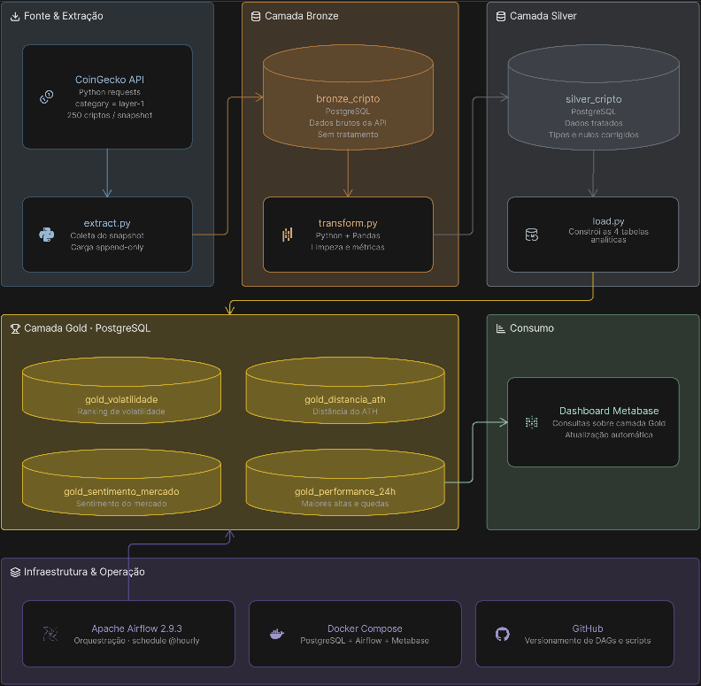
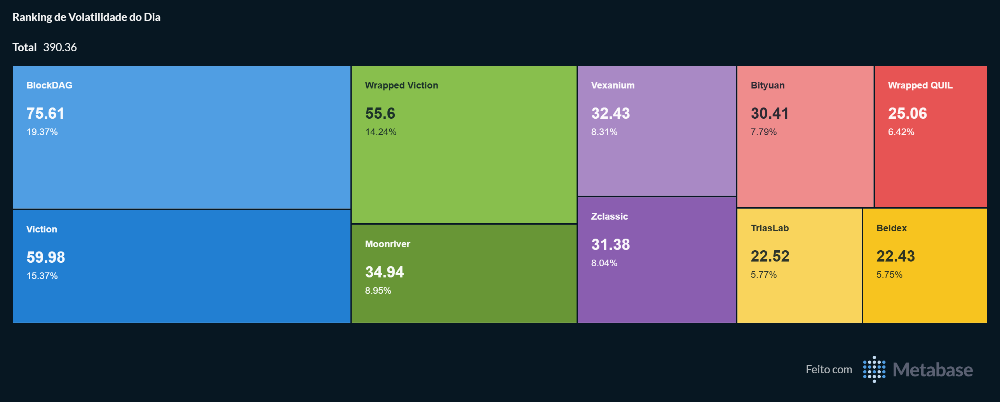
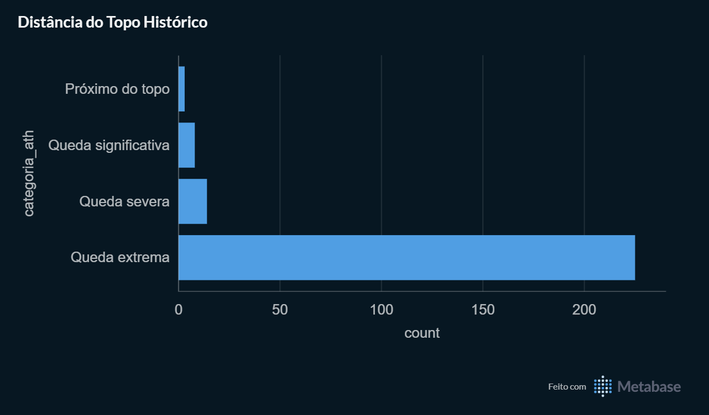
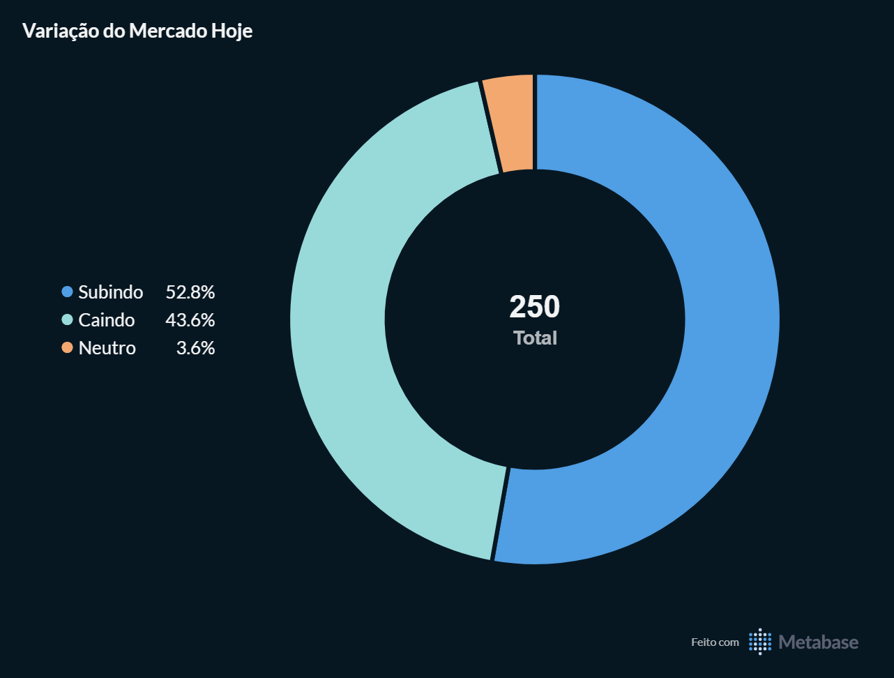
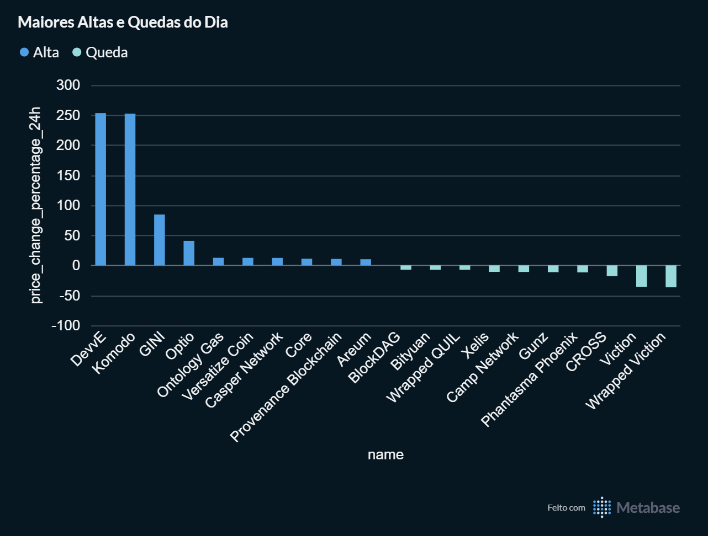
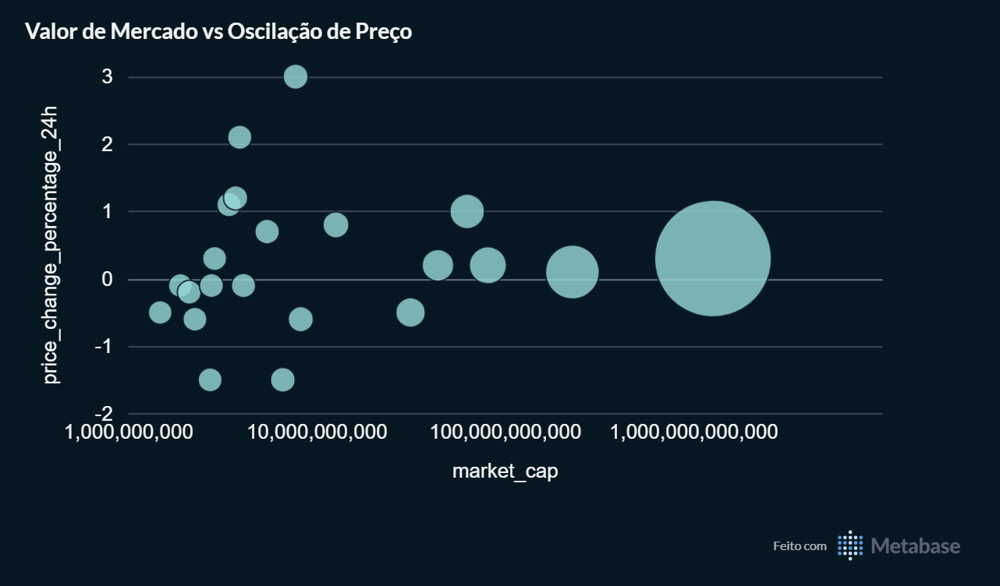

# Pipeline ETL de Criptomoedas - Arquitetura Medallion

Pipeline de dados end-to-end que coleta, transforma e disponibiliza análises de mercado das principais criptomoedas, com atualização automática a cada hora.



---

## Sobre o Projeto

Pipeline de dados end-to-end construído para demonstrar boas práticas de engenharia de dados, desde a coleta via API até a visualização em dashboard, com orquestração automatizada e arquitetura Medallion.

A fonte de dados é a API pública do CoinGecko, filtrando as 250 principais criptomoedas por market cap. Os dados são coletados a cada hora e armazenados em camadas progressivas (Bronze → Silver → Gold), seguindo a arquitetura Medallion. O resultado final é um dashboard no Metabase com 5 análises de mercado atualizadas automaticamente.

---

## Stack

| Camada | Tecnologia |
|---|---|
| Extração | Python 3, requests |
| Transformação | pandas |
| Armazenamento | PostgreSQL 16 |
| Orquestração | Apache Airflow 2.9.3 |
| Containerização | Docker + Docker Compose |
| Visualização | Metabase |
| Versionamento | GitHub |

---

## Arquitetura Medallion

O pipeline segue o padrão Medallion de três camadas, garantindo separação clara entre dado bruto, dado tratado e dado analítico.

### 🥉 Camada Bronze - `bronze_cripto`

**Objetivo:** preservar o dado exatamente como veio da API, sem nenhuma transformação.

| Campo | Tipo | Descrição |
|---|---|---|
| id | text | Identificador único da crypto (ex: bitcoin) |
| symbol | text | Símbolo de mercado (ex: btc) |
| name | text | Nome completo |
| current_price | float | Preço atual em USD |
| market_cap | float | Capitalização de mercado em USD |
| market_cap_rank | int | Posição no ranking global |
| total_volume | float | Volume negociado nas últimas 24h |
| high_24h | float | Preço máximo das últimas 24h |
| low_24h | float | Preço mínimo das últimas 24h |
| price_change_percentage_24h | float | Variação percentual em 24h |
| ath | float | All-time high (maior preço histórico) |
| ath_change_percentage | float | Distância percentual do ATH |
| data_coleta | timestamp | Momento da coleta - chave do histórico |

**Modo de carga:** `append` - cada execução adiciona um novo snapshot sem apagar o histórico anterior.

**Por que preservar o dado bruto?** Qualquer erro de transformação pode ser corrigido reprocessando a partir da Bronze, sem precisar buscar os dados na API novamente.

---

### 🥈 Camada Silver - `silver_cripto`

**Objetivo:** dado limpo, tipado corretamente e com métricas derivadas prontas para análise.

Herda todos os campos da Bronze e adiciona:

| Campo | Tipo | Descrição |
|---|---|---|
| amplitude_pct_24h | float | `(high_24h - low_24h) / low_24h * 100` - volatilidade do dia |
| posicao_no_range_24h | float | Onde o preço atual está entre mínima e máxima (0 = mínima, 1 = máxima) |
| volume_milhoes | float | Volume em milhões (legibilidade) |
| categoria_ath | text | Classificação da distância do ATH em 4 faixas |

**Classificação `categoria_ath`:**

| Faixa | Label |
|---|---|
| -100% a -70% | Queda extrema |
| -70% a -40% | Queda severa |
| -40% a -10% | Queda significativa |
| -10% a 0% | Próximo do topo |

**Transformações aplicadas:**
- Remoção de duplicatas por `id`
- Remoção de linhas sem `current_price` ou `market_cap`
- Tipagem explícita de todas as colunas numéricas
- Padronização de texto (strip + lowercase)

**Modo de carga:** `append` - acumula histórico igual à Bronze.

---

### 🥇 Camada Gold - 4 tabelas analíticas

**Objetivo:** dados agregados e prontos para consumo direto pelo Metabase, sem nenhuma transformação adicional na visualização.

---

#### `gold_volatilidade`

**O que responde:** quais criptomoedas mais oscilaram nas últimas 24h?

| Campo | Tipo | Descrição |
|---|---|---|
| id | text | Identificador da crypto |
| name | text | Nome |
| data_coleta | timestamp | Snapshot |
| amplitude_pct_24h | float | Variação percentual entre máxima e mínima do dia |
| posicao_no_range_24h | float | Posição do preço atual no range do dia |

**Resultado no dashboard:** treemap com as 10 cryptos mais voláteis do dia.

---

#### `gold_distancia_ath`

**O que responde:** o quão longe cada crypto está do seu topo histórico?

| Campo | Tipo | Descrição |
|---|---|---|
| id | text | Identificador da crypto |
| name | text | Nome |
| data_coleta | timestamp | Snapshot |
| ath_change_percentage | float | Distância percentual do ATH (sempre negativo) |
| categoria_ath | text | Classificação em 4 faixas |

**Resultado no dashboard:** gráfico de barras com distribuição das 250 criptomoedas por categoria de distância do ATH (all time high).

---

#### `gold_sentimento_mercado`

**O que responde:** o mercado está subindo ou caindo hoje?

| Campo | Tipo | Descrição |
|---|---|---|
| data_coleta | timestamp | Snapshot |
| total_moedas | int | Total de cryptos no snapshot |
| subindo | int | Quantidade com variação positiva em 24h |
| caindo | int | Quantidade com variação negativa em 24h |
| neutro | int | Quantidade com variação zero |
| pct_subindo | float | Percentual subindo |
| pct_caindo | float | Percentual caindo |

**Resultado no dashboard:** gráfico de pizza com proporção de cryptos subindo vs caindo.

---

#### `gold_performance_24h`

**O que responde:** quais foram as maiores altas e quedas do dia?

| Campo | Tipo | Descrição |
|---|---|---|
| id | text | Identificador da crypto |
| name | text | Nome |
| data_coleta | timestamp | Snapshot |
| price_change_percentage_24h | float | Variação percentual em 24h |
| market_cap | float | Capitalização de mercado |
| tipo | text | "Alta" ou "Queda" |

**Resultado no dashboard:** gráfico de barras com top 10 altas e top 10 quedas lado a lado.

---

## DAG — Orquestração com Airflow

```
start → extract → load_bronze → transform → load_silver → load_gold → end
```

- **Schedule:** `0 * * * *` (todo início de hora)
- **catchup:** desabilitado
- **max_active_runs:** 1

O `load_gold` implementa um DELETE por `data_coleta` antes de cada INSERT, evitando duplicatas em caso de retry.

---

## Dashboard

5 análises disponíveis no Metabase, atualizadas automaticamente a cada execução:

| Análise | Tabela | Gráfico |
|---|---|---|
| Ranking de Volatilidade do Dia | gold_volatilidade | Treemap |
| Distância do Topo Histórico | gold_distancia_ath | Barra horizontal |
| Variação do Mercado Hoje | gold_sentimento_mercado | Pizza |
| Maiores Altas e Quedas do Dia | gold_performance_24h | Barra |
| Tamanho vs Oscilação de Preço | silver_cripto | Dispersão |

### Ranking de Volatilidade do Dia


### Distância do Topo Histórico


### Variação do Mercado Hoje


### Maiores Altas e Quedas do Dia


### Tamanho de Mercado vs Oscilação de Preço


---

## Como Rodar

### Pré-requisitos

- [Docker Desktop](https://www.docker.com/products/docker-desktop) instalado e rodando
- [Git](https://git-scm.com/)
- Chave de API gratuita do [CoinGecko](https://www.coingecko.com/en/api)

### Passo a passo

**1. Clone o repositório**
```bash
git clone https://github.com/kenjikwb/pipeline-etl-cripto
cd pipeline-etl-cripto
```

**2. Crie o arquivo `.env`**

Crie um arquivo `.env` na raiz do projeto com as seguintes variáveis:

```env
DB_HOST=localhost
DB_PORT=5433
DB_NAME=estudos
DB_USER=postgres
DB_PASSWORD=sua_senha_aqui
COINGECKO_API_KEY=sua_chave_aqui
AIRFLOW_SECRET_KEY=qualquer_string_aleatoria
AIRFLOW_ADMIN_USER=admin
AIRFLOW_ADMIN_PASSWORD=admin
AIRFLOW_ADMIN_EMAIL=admin@example.com
```

**3. Suba os containers**
```bash
docker-compose up -d
```

Aguarde todos os containers ficarem healthy (~2 minutos).

**4. Acesse as interfaces**

| Interface | URL | Credenciais |
|---|---|---|
| Airflow | http://localhost:8080 | admin / admin |
| Metabase | http://localhost:3000 | configurar no primeiro acesso |

**5. Ative a DAG no Airflow**

Acesse `localhost:8080`, ative a DAG `pipeline_cripto` e dispare manualmente para popular os dados iniciais.

**6. Configure o Metabase**

Em `localhost:3000`, conecte ao PostgreSQL:
- Host: `postgres`
- Porta: `5432`
- Banco: `estudos`
- Usuário: `postgres`
- Senha: a mesma do `.env`

---

## Estrutura do Repositório

```
pipeline-etl-cripto/
├── dags/
│   └── pipeline_cripto.py     # DAG do Airflow
├── src/
│   ├── config.py              # Configuração e conexão com o banco
│   ├── extract.py             # Coleta da API CoinGecko
│   ├── transform.py           # Limpeza e métricas derivadas
│   ├── load.py                # Carga nas camadas Bronze, Silver e Gold
│   └── main.py                # Execução local do pipeline
├── docs/
│   └── arquitetura.png        # Diagrama da arquitetura
├── docker-compose.yaml
├── .env.example
├── .gitignore
└── README.md
```

---

## Autor

**Fabio Kenji Kawabe**  
Economista | Data Engineer | Python · SQL · ETL
[LinkedIn](https://linkedin.com/in/kenjikwb) · [GitHub](https://github.com/kenjikwb)
